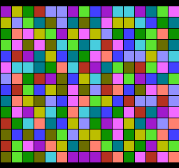

# nes-colorsquares
Shows colored squares on the NES (Nintendo Entertainment System). On each frame, two adjacent squares trade places. Assembles with [asm6f](https://github.com/freem/asm6f). Only tested on FCEUX. The assembled program (`.nes`) is in `bin.zip`.

Note: the program does not work at the moment.

## How to assemble
* Get the binary files (`*.bin`):
  * Either extract them from `bin.zip`&hellip;
  * &hellip;or generate them yourself (see `assemble` and [my NES utilities](https://github.com/qalle2/nes-util)).
* Get `nes.asm` from [my NES utilities](https://github.com/qalle2/nes-util).
* In `src/colorsquares.asm`, make sure the path to `nes.asm` is correct.
* Under the `src` directory, run `asm6f colorsquares.asm ../colorsquares.nes`

Note: the Linux script `assemble` is intended for my personal use. Don't run it before reading it.

## Screenshot

## Technical info
* mapper: NROM (iNES mapper number 0)
* PRG ROM: 16 KiB
* CHR ROM: 8 KiB
* name table mirroring: vertical
* save RAM: none
* compatibility: NTSC and PAL

